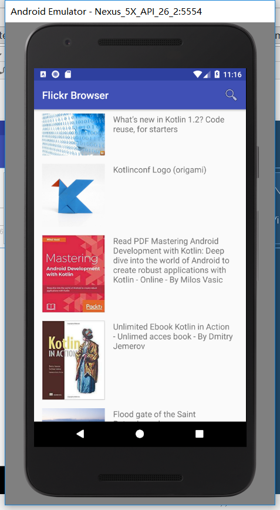

# Flickr Browser

Flickr android client

## Built With

* [kotlin](https://kotlinlang.org/) - The programming language used
* [Picasso](http://square.github.io/picasso/) - Image downloading and caching library for Android

## Versioning

I use [git](https://git-scm.com/) for versioning. For the versions available, see the [tags on this repository](https://github.com/dwfgh/FlickrBrowser/tags).

## Authors

* **Leon Du@dwfgh** - _Initial work_ - [FlickrBrowser](https://github.com/dwfgh/FlickrBrowser)

## License

This project is licensed under the MIT License - see the [LICENSE](LICENSE) file for details

## Acknowledgments

* Tim Buchalka, Jean-Paul Roberts
